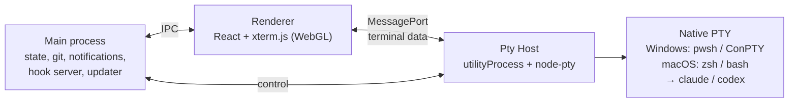

<div align="center">


# ajzakomator

**A terminal grid for running many Claude Code and Codex agents side by side on Windows and macOS.**

Projects on the left, grids of real terminals in the middle, prompts one click away.
Switch projects without stopping a single agent, and come back to any conversation later.

[](https://github.com/adamejzak/ajzakomator/releases/latest)
[](https://github.com/adamejzak/ajzakomator/releases)
[](https://github.com/adamejzak/ajzakomator/actions/workflows/ci.yml)
[](#install)
[](LICENSE)

[**Download**](https://github.com/adamejzak/ajzakomator/releases/latest) · [Features](#features) · [Shortcuts](#keyboard-shortcuts) · [How it works](#how-it-works) · [Po polsku](README.pl.md)

<br />


</div>

<br />

## Why

Running one AI coding agent is easy. Running six of them across three repos is not: terminals pile up,
you lose track of which one is waiting for you, and closing a window means losing the conversation.

ajzakomator gives every project its own set of terminal grids, keeps every agent running in the
background, tells you which one needs you, and brings any grid or conversation back with one click.

## Features

- **Optional agent MCP**: background grids, roles, tasks with results and messages in the AI panel. Ordinary grids default to no MCP — [usage guide (Polish)](docs/MCP.md).
**Grids that fit the work**
- 1, 2, 2×2 up to 5×4, plus row layouts like `3+2` or `2+2+1`, and merged cells
- Several grids per project as tabs; `+ Dodaj` grows the current grid one agent at a time
- Every cell can have its own name, color, startup prompt and an isolated `git worktree`
- Presets for setups you use often, global or per project

**Built for agents**
- Profiles for **Claude Code**, **Codex** and a shell: **PowerShell** on Windows, **zsh / bash** on macOS, with your own CLI flags
- Live status per cell, tab and project: ◐ working, ● waiting for you
- Desktop notification when a background agent finishes or asks for permission; click it to jump there
- Cells are named after the conversation automatically

**Never lose a conversation**
- Restart the app and every grid comes back with its conversations resumed
- Closed grids go to History and return with one click
- Browse past Claude and Codex conversations of a project, including ones started outside the app

**Prompts at your fingertips**
- Snippet library with icons and colors: click to paste into the focused cell, Shift+click to send to the whole grid, or drag onto any cell
- `Ctrl+K` (`Cmd+K` on macOS) command palette over projects, grids, snippets, presets, history and actions

**Native terminals on both platforms**
- Windows uses ConPTY; macOS uses PTYs with interactive login shells, including your shell's agent `PATH`
- macOS supports `Cmd+C` / `Cmd+V` for terminal copy and paste
- On Windows, the terminal behaves like Windows Terminal:
- Agent colors, mouse clicks inside TUIs, AltGr characters and clipboard images all work
- **Hold Space to dictate** works in Codex and Claude, which most xterm based grids break
- GPU rendering, smooth with a 4×3 grid of busy agents

**Small things that add up**
- Project icons (emoji or your own image), drag to reorder projects and snippets
- Resize both side panels by dragging their inner edge; double click to reset. Widths and list order are saved
- Browse the active project's file tree in the sidebar's Files tab, preview text, or open files in your editor
- Right-click projects, grids, snippets, files, or empty panel space for their actions; click the project editor's avatar to choose an image
- Auto updates for the installed Windows app; macOS and portable Windows builds link to the download page
- Polish, English, German, Spanish, French and Portuguese UI: choose on first launch, change anytime in Settings
- Dark, minimal UI in the spirit of Cursor

<table>
  <tr>
    <td width="50%"></td>
    <td width="50%"></td>
  </tr>
  <tr>
    <td align="center"><sub>New grid: layout, names, profiles and startup prompts per cell</sub></td>
    <td align="center"><sub><code>Ctrl+K</code> palette over everything</sub></td>
  </tr>
</table>

## Install

**Windows**

1. Download **`ajzakomator-Setup-x.y.z.exe`** from the [latest release](https://github.com/adamejzak/ajzakomator/releases/latest)
2. Run it. Windows SmartScreen may warn about an unsigned app: choose *More info* and *Run anyway*
3. Choose the app language on first launch
4. Add a project (any folder) and open a grid

The installed app updates itself. `ajzakomator-Portable-x.y.z.exe` runs without installing but does not auto update.

**macOS (Apple Silicon and Intel)**

1. Download **`ajzakomator-x.y.z-mac-arm64.dmg`** for Apple Silicon or **`ajzakomator-x.y.z-mac-x64.dmg`** for Intel from the [latest release](https://github.com/adamejzak/ajzakomator/releases/latest).
2. Open the DMG and drag **ajzakomator** to **Applications**. ZIP packages are also available.
3. Open the app, choose a language, then add a project and open a grid.

Mac builds use an ad-hoc signature without an Apple Developer certificate and are not notarized; macOS may require **Open Anyway** in **System Settings → Privacy & Security**. Updates are installed manually from the download page; automatic updates need a publisher signing identity. See [Electron's signing requirements](https://www.electronjs.org/docs/latest/tutorial/code-signing#macos-apis-that-require-code-signing).

**Requirements:** Windows 10 1809+ or Windows 11 ([PowerShell 7](https://aka.ms/powershell) recommended), or macOS with zsh/bash. Install the agents you want to use on your shell's `PATH` (`claude`, `codex`). `git` is needed only for worktrees.

**Languages:** English, Polish, German, Spanish, French and Portuguese. First launch suggests your system language and asks you to confirm it. Use **Settings → App language** to change it immediately. Existing installations keep Polish until you change it.

## Keyboard shortcuts

On macOS, replace **Ctrl** with **Cmd** and **Alt** with **Option** in the app shortcuts below.

| Shortcut | Action |
|---|---|
| `Ctrl+K` / `Ctrl+Shift+P` | Command palette |
| `Ctrl+Shift+T` | New tab with a single terminal |
| `Ctrl+Shift+G` | New grid or preset |
| `Ctrl+Shift+N` | Add an agent to the current grid |
| `Ctrl+Shift+W` | Close the grid (it goes to History) |
| `Ctrl+Shift+H` | History of conversations and grids |
| `Ctrl+Shift+M` | Maximize or restore the cell (or double click its header) |
| `Ctrl+Alt+Arrows` | Move between cells |
| `Ctrl+Tab` | Next grid |
| `Ctrl+Shift+B` / `Ctrl+Shift+E` | Toggle snippets / projects panel |
| `Ctrl+Wheel` | Zoom a single cell |

Plain `Ctrl+T`, `Ctrl+B` and `Ctrl+W` in terminals are left alone on purpose: Claude Code and Codex use them.

## How it works



- **Pty Host.** All terminals live in a separate process and stream straight to the window, so a dozen chatty agents never freeze the UI. Reloading the window keeps every agent alive and replays its output.
- **Terminal fidelity.** On Windows, node-pty runs with the bundled, newer ConPTY, and ajzakomator implements Windows Terminal's `win32-input-mode`. That delivers real key release events, which is what makes hold Space to talk work. macOS uses native POSIX PTYs.
- **Status.** Claude Code reports through per-cell hooks passed with `--settings` (your own `settings.json` is never touched). Codex is read from its terminal notifications, with an activity heuristic as a fallback.
- **Resume.** Claude cells start with a known `--session-id` and resume with `--resume`. Codex sessions are matched to their cell from `~/.codex/sessions` and resumed with `codex resume`.
- **Your data stays local.** State lives in `%APPDATA%\ajzakomator\state.json` on Windows and `~/Library/Application Support/ajzakomator/state.json` on macOS. Nothing is sent anywhere except the update check against GitHub Releases.

## Development

```powershell
git clone https://github.com/adamejzak/ajzakomator
cd ajzakomator
npm install          # .npmrc sets legacy-peer-deps
npm run dev          # app with hot reload
npm test             # unit tests + integration tests against a real native PTY
npm run dist:win     # Windows installer + portable build in release/
npm run dist:mac     # macOS DMG + ZIP in release/ (run on a Mac)
npm run test:packaged # verify node-pty using the packaged Electron runtime
```

Built with Electron, TypeScript, React, Zustand, xterm.js, node-pty, electron-vite and Vitest.

**CI builds:** [`.github/workflows/ci.yml`](.github/workflows/ci.yml) tests and packages Windows x64, macOS ARM64 (`macos-15`) and macOS x64 (`macos-15-intel`) on their native runners. Pushes to `main`, `v*` tags, pull requests and manual runs upload installer artifacts. macOS builds rebuild native dependencies for Electron and run a packaged terminal smoke test. You can trigger Mac builds from Windows with **Actions → CI → Run workflow** after the workflow is pushed.

| Path | What lives there |
|---|---|
| `src/shared` | Pure logic: layouts, state model, launch commands, status tracking, key encoding |
| `src/ptyhost` | The terminal process (node-pty) |
| `src/main` | Electron main: persistence, sessions index, hooks, worktrees, updater |
| `src/renderer` | The UI |
| `test` | Vitest suites |

Windows releases: `npm run release` bumps the version, runs the tests, builds and publishes to GitHub Releases
(set `NOTES="what changed"` for release notes).
To publish all platforms together, push a version tag, wait for CI to pass, and run **Actions → Publish release** with the tag and successful CI run ID. Add notes in `docs/releases/x.y.z.md` first. The workflow checks that the build matches the tag, verifies package hashes, combines both Mac update manifests, and publishes all installers in one release.

## Roadmap

- Linux builds
- Split view across projects
- Per-grid environment variables

Ideas and bug reports are welcome in [Issues](https://github.com/adamejzak/ajzakomator/issues).

## License

[MIT](LICENSE). Not affiliated with Anthropic or OpenAI. Claude Code and Codex are their respective owners' products.
