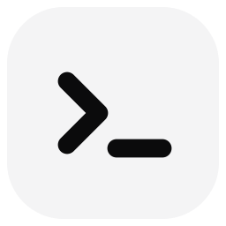
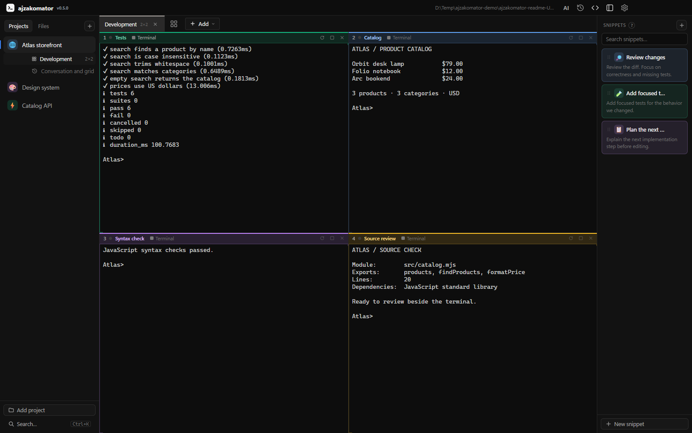
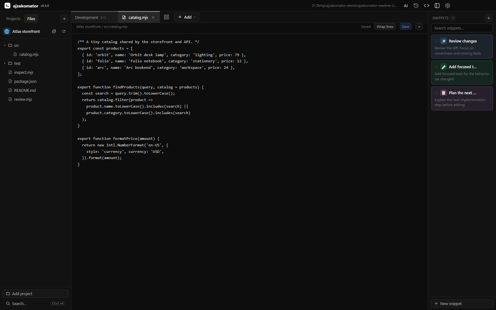
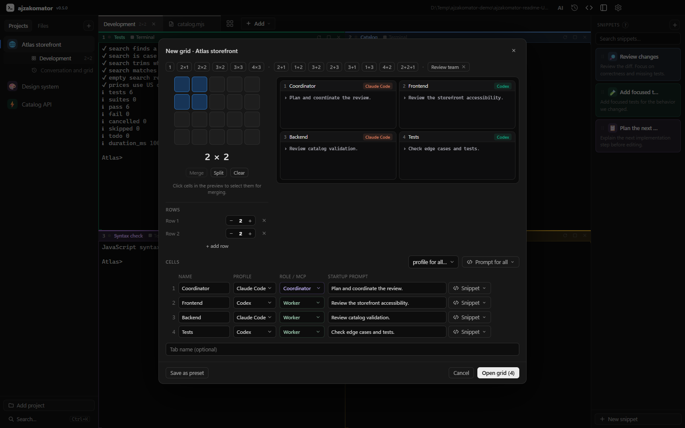
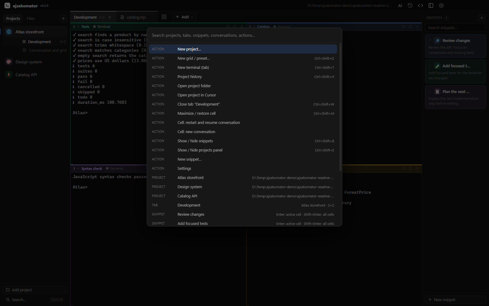

# ajzakomator

**Siatka terminali do pracy z wieloma agentami Claude Code i Codex naraz, na Windowsie i macOS (Apple Silicon oraz Intel).**

Projekty, rozmowy z agentami, pliki i gotowe prompty w jednym miejscu.
Przełączaj projekty, gdy terminale nadal pracują w tle.

[**Pobierz**](https://github.com/adamejzak/ajzakomator/releases/latest) · [Funkcje](#co-potrafi) · [Skróty](#skróty) · [MCP](docs/MCP.md) · [English](README.md)

## Co potrafi

- **Opcjonalny MCP dla agentów**: role, gridy w tle, zadania z wynikami i wiadomości w panelu AI. Zwykłe gridy domyślnie działają bez MCP — [instrukcja](docs/MCP.md).
- **Projekty po lewej**, a w każdym kilka gridów jako zakładki: od jednego terminala po 5×4, układy rzędami (`3+2`, `2+2+1`) i scalanie komórek
- **Każda komórka** może mieć nazwę, kolor, prompt startowy i osobny `git worktree`
- **Statusy na żywo**: ◐ pracuje, ● czeka na Ciebie, plus powiadomienie systemowe, gdy agent w tle skończy
- **Nic nie ginie**: po restarcie aplikacji rozmowy same się wznawiają, zamknięte gridy trafiają do Historii, a lista starych czatów Claude i Codex jest pod ręką
- **Snippety** z ikonami i kolorami: klik wkleja do aktywnej komórki, Shift+klik do całej siatki, można też przeciągnąć na komórkę
- **Układ paneli**: przeciągnij krawędź projektów lub snippetów, aby zmienić szerokość; podwójny klik przywraca domyślną. Szerokości i kolejność projektów oraz snippetów są zapamiętywane
- **Pliki i edytor kodu**: zakładka „Pliki” pokazuje drzewo projektu; kod możesz edytować w aplikacji lub otworzyć w edytorze zewnętrznym. Dostępne są też skróty do Eksploratora Windows lub Findera
- **Menu pod prawym przyciskiem**: na projekcie, gridzie, snippecie, pliku i pustej przestrzeni paneli. W edytorze projektu kliknięcie avatara wybiera własną ikonę, a „Anuluj” odrzuca zmiany
- **Paleta `Ctrl+K` (`Cmd+K` na Macu)** przeszukuje projekty, gridy, snippety, presety, historię i akcje
- **Terminale systemowe**: Windows korzysta z PowerShella i ConPTY, macOS z zsh/bash i PTY. Na Macu działają `Cmd+C` / `Cmd+V`, a powłoka logowania wczytuje `PATH` agentów
- **Na Windowsie terminal jak w Windows Terminal**: kolory agentów, klikanie myszą, AltGr, wklejanie obrazków i **przytrzymanie spacji do dyktowania**
- **Języki aplikacji**: polski, angielski, niemiecki, hiszpański, francuski i portugalski. Wybór po pierwszym uruchomieniu po instalacji, późniejsza zmiana od razu w ustawieniach
- **Automatyczne aktualizacje** zainstalowanej wersji Windows; Mac i wersja portable wskazują stronę pobierania

| Układ zespołu | Szybkie wyszukiwanie |
| --- | --- |
|  |  |

Zrzuty przedstawiają rzeczywistą aplikację w języku angielskim, z jednorazowymi projektami demonstracyjnymi i wynikami prawdziwych poleceń powłoki. Nie zawierają rozmów z modelami. [Instrukcja odtworzenia zrzutów](docs/screenshots/README.md).

## Instalacja

**Windows**

1. Pobierz **`ajzakomator-Setup-x.y.z.exe`** z [najnowszego wydania](https://github.com/adamejzak/ajzakomator/releases/latest)
2. Uruchom. Jeśli Windows SmartScreen ostrzeże przed niepodpisaną aplikacją, wybierz *Więcej informacji* i *Uruchom mimo to*
3. Wybierz język przy pierwszym uruchomieniu
4. Dodaj projekt (dowolny folder) i otwórz grid

**macOS**

1. Pobierz **`ajzakomator-x.y.z-mac-arm64.dmg`** dla Apple Silicon albo **`ajzakomator-x.y.z-mac-x64.dmg`** dla Intela z [najnowszego wydania](https://github.com/adamejzak/ajzakomator/releases/latest).
2. Otwórz DMG i przeciągnij **ajzakomator** do **Aplikacji**. Dostępne są też archiwa ZIP.
3. Uruchom aplikację, wybierz język, dodaj projekt i otwórz grid.

Buildy Maca mają podpis ad hoc bez certyfikatu Apple Developer i nie są notaryzowane. macOS może wymagać opcji **Otwórz mimo to** w **Ustawienia systemowe → Prywatność i ochrona**. Aktualizacje instaluje się ręcznie; automatyczne aktualizacje potrzebują podpisu wydawcy. Zobacz [wymagania podpisywania Electrona](https://www.electronjs.org/docs/latest/tutorial/code-signing#macos-apis-that-require-code-signing).

Wymagania: Windows 10 1809+ lub 11 (zalecany PowerShell 7) albo macOS z zsh/bash, `claude` i/lub `codex` w `PATH` powłoki, `git` tylko do worktree.

Język zmienisz w **Ustawienia → Język aplikacji**. Przy pierwszym uruchomieniu aplikacja proponuje język systemu i prosi o jego potwierdzenie. Dotychczasowe instalacje zachowują polski.

## Pierwszy projekt

1. Dodaj folder, w którym chcesz pracować. Polecenia agentów uruchamiają się w folderze projektu.
2. Otwórz terminal albo utwórz grid i wybierz profil dla każdej komórki. Opcjonalnie dodaj nazwy i prompty startowe.
3. Zostaw **Bez MCP** dla zwykłych sesji lub wybierz role wykonawcy i koordynatora dla zarządzanego zespołu.
4. Otwórz **Pliki**, aby przeglądać i edytować kod. Powtarzalne instrukcje zapisz jako snippety.

## Aktualizacje

Zainstalowana wersja Windows sprawdza GitHub Releases i pobiera aktualizacje w tle. Nagłówek pokazuje postęp, rozmiar i prędkość pobierania. Gdy pobieranie się skończy, wybierz **Nowa wersja … · uruchom ponownie** albo zamknij aplikację normalnie — pobrana aktualizacja zainstaluje się bez ponownego uruchamiania. Przed restartem zapisz zmiany w edytorze. Rozmowy agentów są przywracane przez mechanizm wznowienia ich CLI.

Ręczne sprawdzenie: kliknij prawym przyciskiem nazwę i wersję **ajzakomator**, a następnie wybierz **Sprawdź aktualizacje**. Po błędzie nagłówek pokazuje jego treść i pozwala ponowić próbę.

Wersja portable Windows i aplikacja macOS otwierają stronę pobierania. Zastąp aplikację nowym wydaniem; dane są przechowywane osobno. Wersja deweloperska nie instaluje aktualizacji.

## Po co włączać MCP?

Zwykły grid wystarczy do niezależnych rozmów. MCP przydaje się, gdy agenci mają dzielić zadania i przekazywać sobie wyniki: w panelu **AI** widać, kto odpowiada za pracę, jakie pliki zmienił i co jest gotowe do review.

Dla funkcji obejmującej API i interfejs nazwij i pokoloruj komórki **Koordynator**, **Backend**, **Frontend** i **Review**. Wybierz Claude Code lub Codex osobno dla każdej komórki. Model i opcje CLI skonfigurujesz flagami profilu; koordynator może też wybrać model komórki przez MCP. Możesz włączyć role w istniejącym gridzie przez **AI → Agenci** albo utworzyć nowy z rolami i promptami startowymi. Przy zmianie roli aplikacja proponuje zastosowanie jej i restart ze wznowieniem zapisanej sesji albo odłożenie restartu.

Panel agentów odróżnia wymagany restart, konfigurację oczekującą na agenta i działające połączenie MCP. Samo uruchomienie lokalnego serwera nie oznacza, że agent już się z nim połączył.

1. Poproś koordynatora o podział funkcji i delegowanie zadań wybranym wykonawcom. Przy wspólnym katalogu ustalcie własność plików; worktree ułatwiają pracę na osobnych gałęziach.
2. Poproś koordynatora o zadanie frontendu z `dependsOn` wskazującym zadanie backendu. Backend raportuje kontrakt API, zmienione pliki i testy, a wiadomością przekazuje pracę frontendowi.
3. Frontend raportuje implementację. Agent review otrzymuje zadanie z wynikami obu części i sprawdza diff oraz testy.
4. Przejrzyj wyniki w **AI → Zadania**, zleć poprawki i zdecyduj o integracji. Zespół możesz zapisać jako preset.

Zadania i wiadomości są trwałym zapisem przekazania pracy. Nie gwarantują automatycznego uruchomienia modelu. Jeśli sesja nie ma potwierdzonego dostarczania natywnego, skopiuj prompt do właściwego terminala. [Instrukcja MCP](docs/MCP.md) opisuje role, dostarczanie i pauzę.

## Skróty

Na macOS w skrótach aplikacji używaj **Cmd** zamiast **Ctrl** oraz **Option** zamiast **Alt**.

| Skrót | Akcja |
|---|---|
| `Ctrl+K` / `Ctrl+Shift+P` | paleta poleceń |
| `Ctrl+Shift+T` | nowa zakładka z jednym terminalem |
| `Ctrl+Shift+G` | nowy grid lub preset |
| `Ctrl+Shift+N` | dodaj agenta do bieżącej siatki |
| `Ctrl+Shift+W` | zamknij grid (trafia do Historii) |
| `Ctrl+Shift+H` | historia czatów i gridów |
| `Ctrl+Shift+M` | maksymalizuj komórkę |
| `Ctrl+Alt+strzałki` | przejście między komórkami |
| `Ctrl+Tab` | następny grid |
| `Ctrl+Shift+B` / `Ctrl+Shift+E` | pokaż lub ukryj snippety / projekty |
| `Ctrl+kółko myszy` | powiększenie w jednej komórce |

Zwykłe `Ctrl+T`, `Ctrl+B` i `Ctrl+W` w terminalach są pozostawione agentom Claude Code i Codex.

W zakładce edytora **Ctrl+S** / **Cmd+S** zapisuje plik, a **Tab** wstawia wcięcie. Pasek edytora pozwala zawijać wiersze i zamknąć plik. Niezapisane zmiany są oznaczone; zamknięcie proponuje zapis, odrzucenie albo anulowanie. Szkice przetrwają przeładowanie interfejsu, a zapis sprawdza, czy plik na dysku nie został zmieniony.

Więcej szczegółów, w tym architektura i instrukcja dla deweloperów, jest w [README po angielsku](README.md).

## Budowanie

`npm run dist:win` tworzy instalator i wersję portable Windows. `npm run dist:mac` tworzy DMG i ZIP na Macu. `npm run test:packaged` sprawdza terminal w zbudowanej aplikacji.

Workflow [CI](.github/workflows/ci.yml) testuje i buduje Windows x64 oraz macOS ARM64 i x64 na natywnych runnerach. Po wypchnięciu zmian możesz uruchomić build Maca z Windowsa przez **Actions → CI → Run workflow**. Pliki znajdziesz w artefaktach zakończonego uruchomienia; workflow nie publikuje automatycznie wydań.

Wydanie wszystkich platform opublikujesz przez **Actions → Publish release**, podając istniejący tag wersji i ID udanego CI dla tego samego commita. Wcześniej dodaj opis w `docs/releases/x.y.z.md`. Workflow sprawdza sumy paczek i dodaje instalatory Windows oraz DMG/ZIP obu architektur Maca do jednego wydania.

Dane aplikacji są lokalne: `%APPDATA%\ajzakomator\state.json` na Windowsie i `~/Library/Application Support/ajzakomator/state.json` na Macu.

Sprawdzanie aktualizacji łączy się z GitHub Releases. Agenci używają usług skonfigurowanych w ich własnych CLI. Lokalny MCP służy do zarządzania zespołem w aplikacji — [instrukcja po polsku](docs/MCP.md), [English guide](docs/MCP.en.md).

Zrzuty README odtworzysz po zbudowaniu aplikacji poleceniem `node scripts/capture-readme.mjs`. Skrypt korzysta z osobnych danych tymczasowych i rzeczywistego renderera Electron.

## Licencja

[MIT](LICENSE)
